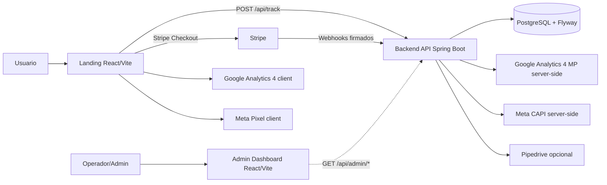
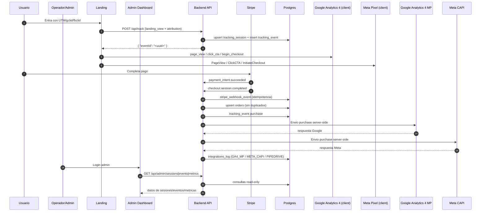
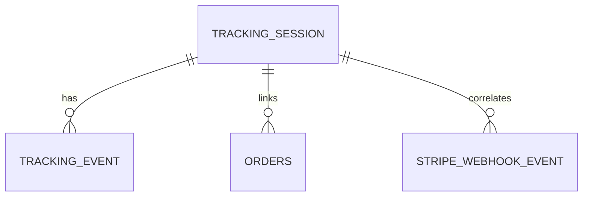
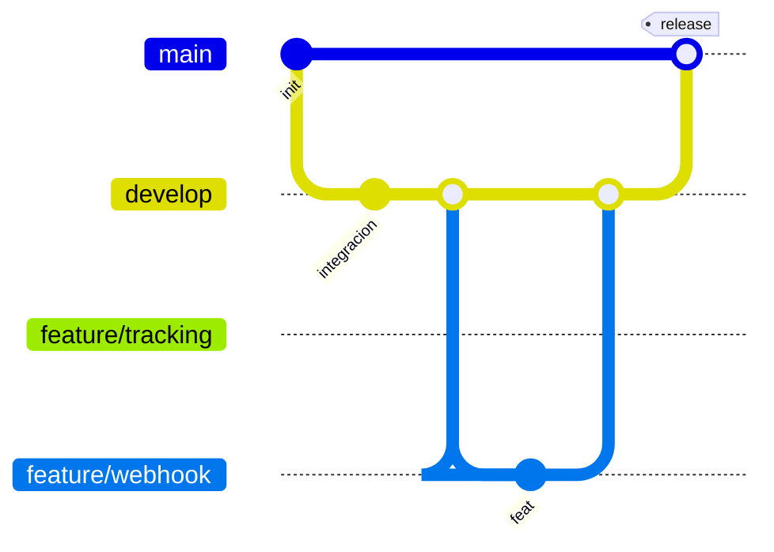

# S02-26-Equipo-15 | Web App Development

Monorepo del equipo 15 para tracking de conversiones, pagos con Stripe y medicion de compras en Google (GA4) y Meta, con panel admin de monitoreo.

## Resumen del proyecto

Plataforma full-stack para medir el funnel de conversion de una landing y correlacionar cada interaccion con un pago en Stripe usando `eventId`.

Incluye:

- Landing web (captura UTM/gclid/fbclid, tracking client-side y redireccion a checkout).
- Backend API (persistencia, procesamiento de webhooks e integraciones server-side para Google y Meta).
- Panel admin (consulta de sesiones, eventos y metricas en tiempo real de la base).
- Base PostgreSQL con migraciones Flyway e historial auditable de integraciones.

## Contexto de negocio

El producto es una solucion all-in-one para incorporacion, impuestos y bookkeeping en EE.UU.

- Propuesta de valor: reducir friccion legal/fiscal para founders y equipos que venden en EE.UU.
- Adquisicion: trafico de anuncios en Google y Meta hacia la landing.
- Conversion: CTA principal que deriva a checkout en Stripe.
- Medicion: eventos client-side (GA4/Meta Pixel) + confirmacion server-side de compra (GA4 MP/Meta CAPI).
- Operacion: panel admin para monitorear sesiones, eventos, compras y metricas del funnel.
- KPI principal: `landing_view -> click_cta -> begin_checkout -> purchase`.

## Objetivo del proyecto

Construir una plataforma con:

- Landing de conversion (React + Vite)
- Backend de tracking/pagos (Spring Boot + PostgreSQL)
- Integraciones server-side (GA4 MP, Meta CAPI, Pipedrive opcional)
- Panel administrador para consulta de datos (React + Vite + TypeScript)

## Estado actual de modulos

- `backend/`: implementado y operativo
- `frontend/landing/`: implementado y operativo
- `frontend/admin/`: implementado y operativo
- `infra/`: documentacion tecnica actualizada

## Validacion del objetivo del proyecto

Estado general: `cumplido a nivel MVP funcional`.

Cumplido:

- Tracking del funnel en landing (`landing_view`, `click_cta`, `begin_checkout`).
- Correlacion por `eventId` entre landing, Stripe y backend.
- Registro de compra y deduplicacion de ordenes/webhooks.
- Integraciones de compra en Google y Meta (GA4 MP y Meta CAPI) con auditoria en DB.
- Panel admin operativo para consultar sesiones, eventos y metricas.

Pendiente para cierre productivo:

- Endurecer autenticacion/autorizacion del admin (hoy usa password demo).
- Cobertura de pruebas E2E y pruebas de carga.
- Observabilidad operativa (alertas, dashboards de salud y SLOs).
- Runbook de despliegue/rollback y validaciones post-deploy.

## Arquitectura del proyecto

```text
/
|-- backend/                 # API - Spring Boot 3 / Java 17
|-- frontend/
|   |-- landing/             # Landing + Checkout (React + Vite)
|   `-- admin/               # Panel Administrador (React + Vite + TypeScript)
|-- infra/                   # Documentacion de arquitectura y modelo de datos
|-- BDD/                     # Documentacion y scripts de base de datos
`-- README.md
```

## Arquitectura end-to-end



## Flujo transaccional



## Endpoints backend

- `POST /api/track`
- `POST /api/stripe/webhook`
- `GET /api/admin/sessions`
- `GET /api/admin/sessions/{eventId}`
- `GET /api/admin/events`
- `GET /api/admin/metrics`
- `GET /api/health/db`
- `GET /actuator/health`

## Modelo de datos (resumen)



Tablas activas:

- `tracking_session`
- `tracking_event`
- `orders`
- `stripe_webhook_event`
- `integrations_log`

## Flujo de ramas Git



## Variables de entorno clave

### Backend (`backend/.env.example`)

- `SPRING_PROFILES_ACTIVE`
- `SPRING_DATASOURCE_URL`
- `SPRING_DATASOURCE_USERNAME`
- `SPRING_DATASOURCE_PASSWORD`
- `STRIPE_WEBHOOK_SECRET`
- `TRACKING_ENABLED`
- `META_CAPI_ENABLED`
- `META_PIXEL_ID`
- `META_ACCESS_TOKEN`
- `GA4_MP_ENABLED`
- `GA4_MEASUREMENT_ID`
- `GA4_API_SECRET`
- `GA4_MP_DEBUG_VALIDATION_ENABLED`
- `PIPEDRIVE_ENABLED`
- `PIPEDRIVE_API_TOKEN`
- `CORS_ALLOWED_ORIGINS`

### Landing (`frontend/landing/.env.example`)

- `VITE_STRIPE_PAYMENT_LINK`
- `VITE_API_URL`
- `VITE_GA_MEASUREMENT_ID`
- `VITE_META_PIXEL_ID`

### Admin (`frontend/admin/.env.example`)

- `VITE_API_URL`
- `VITE_ADMIN_DEMO_PASSWORD`

## Ejecucion local

### Backend

```bash
cd backend
mvn spring-boot:run
```

### Landing

```bash
cd frontend/landing
npm install
npm run dev
```

### Admin

```bash
cd frontend/admin
npm install
npm run dev
```

## Documentacion complementaria

- `backend/README.md`
- `frontend/landing/README.md`
- `frontend/admin/README.md`
- `infra/arquitectura_end-to-end.md`
- `infra/modelo_bdd.md`
- `infra/resumen_end_to_end.md`
- `BDD/README.md`
- `BDD/descripcion_bdd.md`
