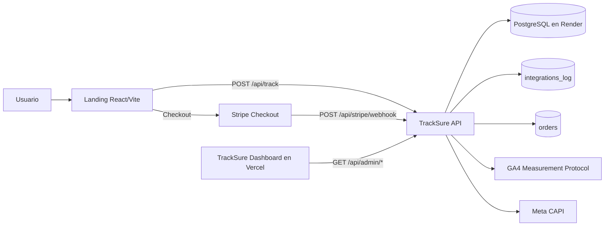

<p align="center">
  
</p>

# TrackSure - Revenue Attribution & Server-Side Conversion Tracking

## A) Resumen

TrackSure es una plataforma de atribucion de ingresos orientada a decisiones reales de negocio.
Conecta navegacion en landing, conversion en Stripe y evidencia operativa en un mismo hilo de datos.
El resultado es trazabilidad end-to-end para saber que campanas generan revenue y donde se pierde conversion.
Cada sesion, evento y pago puede auditarse de punta a punta con una clave comun: `eventId`.

## 🎯 ¿Qué hace diferente a TrackSure?

- Atribucion basada en ingresos reales (Stripe), no solo clicks.
- Correlacion end-to-end con `eventId`.
- Webhook idempotente para evitar ordenes duplicadas.
- Auditoria de integraciones con evidencia de envios, latencia y estado.
- Modelo de datos preparado para analisis de funnel y operacion diaria.

## B) Problema que resuelve

El tracking tradicional pierde confiabilidad justo en el punto mas critico: la conversion.

- Los eventos browser-side pueden degradarse por ITP, bloqueadores y restricciones de cookies.
- Stripe introduce una redireccion que suele romper la correlacion de datos.
- Sin trazabilidad end-to-end, no se sabe que campana genero ingresos reales.
- Operaciones carece de evidencia tecnica para explicar discrepancias entre funnels y revenue.

## C) Como lo resuelve

TrackSure implementa un flujo orientado a consistencia operativa:

- Usa `eventId` como correlacion entre sesion, eventos, webhook y orden.
- Procesa `POST /api/stripe/webhook` con idempotencia por `stripe_event_id`.
- Persiste datos en un modelo separado por responsabilidad (`tracking_session`, `tracking_event`, `orders`).
- Normaliza el estado de negocio en `orders.business_status`.
- Registra auditoria de integraciones en `integrations_log` para GA4 MP y Meta CAPI.

## D) Arquitectura



## E) Componentes del repositorio

- `backend/`: TrackSure API (Spring Boot 3 + Java 17).
- `frontend/landing/`: sitio de entrada y captura inicial de tracking.
- `frontend/admin/`: TrackSure Dashboard (operacion y auditoria).
- `infra/`: arquitectura, modelo de datos y guias tecnicas.

### Decision sobre `/BDD`

Se mantiene la carpeta `/BDD` como carpeta operativa para desarrollo local.
Incluye scripts SQL de apoyo (`schema.sql`, `reset.sql`) y guia de uso en DEV.
La fuente de verdad de produccion sigue siendo Flyway en `backend/src/main/resources/db/migration`.

## F) Modelo de datos y migraciones

- Motor principal: PostgreSQL (Render).
- Migraciones: Flyway (`V1` a `V9`).
- Tablas clave:
  - `tracking_session`
  - `tracking_event`
  - `orders`
  - `stripe_webhook_event`
  - `integrations_log`

Referencia completa del modelo:
- [`infra/modelo_bdd.md`](./infra/modelo_bdd.md)

## G) Endpoints y ejemplos

### Tabla de endpoints principales

| Metodo | Endpoint | Proposito | Seguridad |
|---|---|---|---|
| `POST` | `/api/track` | Registra eventos del funnel y mantiene sesion por `eventId`. | Publico + rate limit |
| `POST` | `/api/stripe/webhook` | Procesa webhook Stripe, actualiza ordenes y logs. | Publico + firma Stripe |
| `GET` | `/api/admin/health` | Verificacion de acceso admin. | Basic Auth (`ADMIN`) |
| `GET` | `/api/admin/sessions` | Lista sesiones con filtros y paginacion. | Basic Auth (`ADMIN`) |
| `GET` | `/api/admin/sessions/{eventId}` | Trazabilidad completa de una sesion. | Basic Auth (`ADMIN`) |
| `GET` | `/api/admin/events` | Lista eventos por tipo/rango. | Basic Auth (`ADMIN`) |
| `GET` | `/api/admin/metrics` | KPIs agregados del dashboard. | Basic Auth (`ADMIN`) |
| `GET` | `/api/health/db` | Health de DB (`SELECT 1`). | Publico |
| `GET` | `/actuator/health` | Health de plataforma. | Publico |

### `POST /api/track` (ejemplo minimo)

```bash
curl -X POST "http://localhost:8080/api/track" \
  -H "Content-Type: application/json" \
  -d '{
    "eventType": "landing_view",
    "utm_source": "google",
    "utm_medium": "cpc",
    "utm_campaign": "spring_sale",
    "landing_path": "/"
  }'
```

### `POST /api/stripe/webhook` (firma Stripe)

```bash
curl -X POST "http://localhost:8080/api/stripe/webhook" \
  -H "Content-Type: application/json" \
  -H "Stripe-Signature: t=1700000000,v1=<firma_generada_por_stripe>" \
  --data-binary @payload.json
```

Nota: el header `Stripe-Signature` debe ser valido y corresponder a `STRIPE_WEBHOOK_SECRET`.

### `GET /api/admin/*` (Basic Auth)

```bash
curl -u "${ADMIN_USER}:${ADMIN_PASS}" \
  "http://localhost:8080/api/admin/health"
```

### Health checks

```bash
curl "http://localhost:8080/api/health/db"
curl "http://localhost:8080/actuator/health"
```

### Swagger

Swagger no esta habilitado en el estado actual.
Opcionalmente, puede habilitarse agregando `springdoc-openapi` al backend y exponiendo `/swagger-ui/index.html`.

## H) Variables de entorno

### Minimas para produccion (Render)

- `PORT` (inyectado por Render)
- `SPRING_DATASOURCE_URL` (JDBC valido: `jdbc:postgresql://host:port/db`)
- `SPRING_DATASOURCE_USERNAME`
- `SPRING_DATASOURCE_PASSWORD`
- `ADMIN_USER`
- `ADMIN_PASS`
- `STRIPE_WEBHOOK_SECRET`

### Opcionales (integraciones y tuning)

- `TRACKING_ENABLED`
- `GA4_MP_ENABLED`
- `GA4_MEASUREMENT_ID`
- `GA4_API_SECRET`
- `GA4_MP_DEBUG_VALIDATION_ENABLED`
- `META_CAPI_ENABLED`
- `META_PIXEL_ID`
- `META_ACCESS_TOKEN`
- `CORS_ALLOWED_ORIGINS`

### Fallback de datasource (si no se define `SPRING_DATASOURCE_URL`)

- `PGHOST`
- `PGPORT`
- `PGDATABASE`
- `PGUSER`
- `PGPASSWORD`

## I) Como correr local

### Requisitos

- Java 17+
- Maven 3.9+
- Node.js 20+
- PostgreSQL local

### 1. Backend (TrackSure API)

```bash
cd backend
mvn spring-boot:run
```

Ejemplo rapido:

```bash
SPRING_DATASOURCE_URL=jdbc:postgresql://localhost:5432/app_db
SPRING_DATASOURCE_USERNAME=postgres
SPRING_DATASOURCE_PASSWORD=postgres
ADMIN_USER=admin
ADMIN_PASS=admin123
```

### 2. Landing

```bash
cd frontend/landing
npm install
npm run dev
```

`.env` sugerido:

```bash
VITE_API_URL=http://localhost:8080
VITE_STRIPE_PAYMENT_LINK=https://buy.stripe.com/...
```

### 3. TrackSure Dashboard

```bash
cd frontend/admin
npm install
npm run dev
```

`.env` sugerido:

```bash
VITE_API_URL=http://localhost:8080
```

## J) Deploy (Render / Vercel)

### Render (TrackSure API + PostgreSQL)

- El backend escucha en `server.port=${PORT:8080}`.
- Render inyecta `PORT` automaticamente.
- Configurar datasource con:
  - `SPRING_DATASOURCE_URL=jdbc:postgresql://<host>:5432/<db>?sslmode=require`
  - `SPRING_DATASOURCE_USERNAME`
  - `SPRING_DATASOURCE_PASSWORD`
- Stripe debe enviar webhook a:
  - `https://<tu-servicio-render>/api/stripe/webhook`

### Vercel (Landing + TrackSure Dashboard)

- `frontend/landing` y `frontend/admin` en proyectos separados.
- En ambos, `VITE_API_URL` debe apuntar al backend en Render.

## 🔍 Observabilidad y Auditoría

TrackSure registra evidencia operativa en tablas dedicadas para poder auditar cada conversion:

- `tracking_session` y `tracking_event`: contexto de navegacion y eventos del funnel.
- `orders`: consolidacion de pago y estado de negocio (`business_status`).
- `stripe_webhook_event`: recepcion, deduplicacion y resultado de procesamiento de webhooks.
- `integrations_log`: registro de envios a GA4 MP y Meta CAPI con `status`, `httpStatus` y `latencyMs`.

Con esto el equipo puede:

- demostrar si una conversion fue efectivamente procesada,
- detectar fallas de integracion o demoras de entrega,
- depurar discrepancias entre marketing, pagos y revenue,
- seguir todo el flujo con `eventId` como hilo conductor tecnico y funcional.

En TrackSure Dashboard, esta informacion se consulta por sesion y permite revisar estado de orden, webhooks e integraciones desde una sola vista.

## 🧪 Estrategia de Testing

Actualmente existe cobertura focalizada en seguridad, idempotencia y consistencia de estados:

- `SecurityConfigTest`: valida proteccion de `/api/admin/**` y acceso publico en endpoints criticos.
- `StripeWebhookIdempotencyTest`: evita reprocesar el mismo evento de Stripe.
- `OrderStatusTransitionTest`: valida transiciones correctas de `business_status`.
- `TrackControllerTest` y `TrackingServiceTest`: protegen contrato y persistencia del tracking por `eventId`.

Esto es clave para evitar dos riesgos de negocio: revenue duplicado por reprocesos y perdida de trazabilidad en conversiones.

Ejecucion:

```bash
cd backend
mvn test
```

Plan de tests para ampliar cobertura:

- pruebas end-to-end del flujo `track -> webhook -> integraciones`,
- pruebas de carga para picos de webhooks,
- pruebas de resiliencia ante errores transitorios en integraciones externas.

## L) Roadmap / pendientes

- Ampliar tests de integracion end-to-end (track -> webhook -> integraciones).
- Incorporar pruebas de carga y resiliencia de webhooks.
- Habilitar Swagger de forma opcional para DX.
- Validar usabilidad del dashboard con usuarios operativos.

## URLs de referencia

| Recurso | URL |
|---|---|
| Landing | https://s02-26-equipo-15-web-app-developmen.vercel.app/ |
| TrackSure Dashboard | https://s02-26-equipo-15-web-app-admin.vercel.app/admin/login |
| TrackSure API | https://s02-26-equipo-15-web-app-development.onrender.com |
| Health API | https://s02-26-equipo-15-web-app-development.onrender.com/actuator/health |
