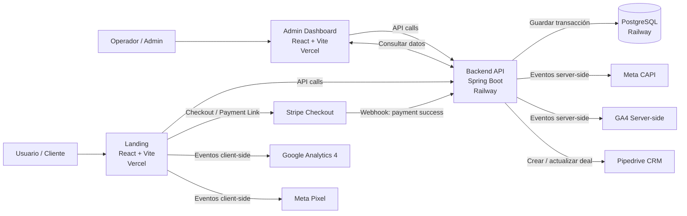

# S02-26 – Equipo 15 | Web App Development

Proyecto desarrollado en el contexto de **No Country**.  
El objetivo es construir una plataforma web orientada a **tracking de conversiones y pagos**, con una **landing de ventas**, un **panel administrador** y un **backend** que integra Stripe y plataformas de ads (Meta y Google).

---

## 🧱 Arquitectura del proyecto

Repositorio en formato **monorepo**, con separación clara de responsabilidades:

```

/
├── backend/                 # API – Java Spring Boot
├── frontend/
│   ├── landing/             # Landing + Checkout (React + Vite)
│   └── admin/               # Panel Administrador (React + Vite)
├── infra/                   # Documentación de infraestructura y deploy
└── README.md

```

### Arquitectura end-to-end



### Despliegue
- **Backend** → Railway (API pública)
- **Base de datos** → PostgreSQL (Railway)
- **Frontend Landing** → Vercel
- **Frontend Admin** → Vercel

---

## 🚀 Stack tecnológico

### Backend
- Java 17+
- Spring Boot
- PostgreSQL
- Stripe (pagos y webhooks)

### Frontend
- React
- Vite
- JavaScript
- Integración con Stripe, Meta Pixel y Google Analytics (GA4)

### Infraestructura
- GitHub (monorepo)
- Railway
- Vercel

---

## 🌱 Flujo de trabajo con Git

- `main` → rama estable (entregables / demo)
- `develop` → integración continua del sprint
- `feature/<ticket>-<descripcion>` → desarrollo por funcionalidad

Ejemplos:
```

feature/NC-01-landing-checkout
feature/NC-02-admin-transactions
feature/NC-03-stripe-webhook

```

Todo el código se integra mediante **Pull Requests**.

---

## 🔐 Variables de entorno

⚠️ **Nunca subir archivos `.env` al repositorio**  
Usar siempre archivos `.env.example`.

### Frontend Landing (`frontend/landing/.env.example`)
```

VITE_STRIPE_PAYMENT_LINK=
VITE_API_BASE=
VITE_META_PIXEL_ID=
VITE_GA_MEASUREMENT_ID=

```

### Frontend Admin (`frontend/admin/.env.example`)
```

VITE_API_BASE=

```

### Backend (`backend/.env.example`)
```
PGHOST=
PGPORT=
PGDATABASE=
PGUSER=
PGPASSWORD=
SPRING_PROFILES_ACTIVE=dev
STRIPE_SECRET_KEY=
STRIPE_WEBHOOK_SECRET=
JWT_SECRET=
```

### Database configuration (Railway)
Set these variables in Railway for the backend service:

```bash
PGHOST=<railway-postgres-host>
PGPORT=<railway-postgres-port>
PGDATABASE=<railway-postgres-database>
PGUSER=<railway-postgres-user>
PGPASSWORD=<railway-postgres-password>
SPRING_PROFILES_ACTIVE=prod
```

For Railway development environment use:

```bash
SPRING_PROFILES_ACTIVE=dev
```

Recommended Railway healthcheck path:

```text
/actuator/health
```

---

## ▶️ Ejecución en local

### Backend
```bash
cd backend
export PGHOST=localhost
export PGPORT=5432
export PGDATABASE=app_db
export PGUSER=postgres
export PGPASSWORD=postgres
export SPRING_PROFILES_ACTIVE=dev
mvn spring-boot:run
```

Disponible en:

```
http://localhost:8080
```

### Frontend Landing

```bash
cd frontend/landing
npm install
npm run dev
```

Disponible en:

```
http://localhost:5173
```

### Frontend Admin

```bash
cd frontend/admin
npm install
npm run dev
```

Disponible en:

```
http://localhost:5174
```

---

## 👥 Roles del equipo

* **Backend**

  * Desarrollo de API
  * Integración con Stripe
  * Webhooks de pagos
  * Persistencia en base de datos

* **Frontend**

  * Landing (UX, checkout, tracking)
  * Admin (dashboard y visualización de transacciones)

* **QA**

  * Testing funcional
  * Validación de pagos en modo test
  * Verificación de eventos de tracking (Meta / GA4)

---

## 📌 Convenciones del proyecto

* No subir:

  * `node_modules`
  * `target`
  * `.env`
* Commits claros y descriptivos
* Desarrollo siempre desde `develop`

---

## 📄 Documentación adicional

* Infraestructura y deploy: `infra/`
* Diagramas: `infra/diagrams/`

---

## 🧾 Licencia

Este proyecto se distribuye bajo la licencia MIT. Revisa el archivo `LICENSE` en la raíz del repositorio para más detalles.

---

## 🏁 Estado del proyecto

🟡 En desarrollo – Sprint inicial
Repositorio y arquitectura base configurados.

```


