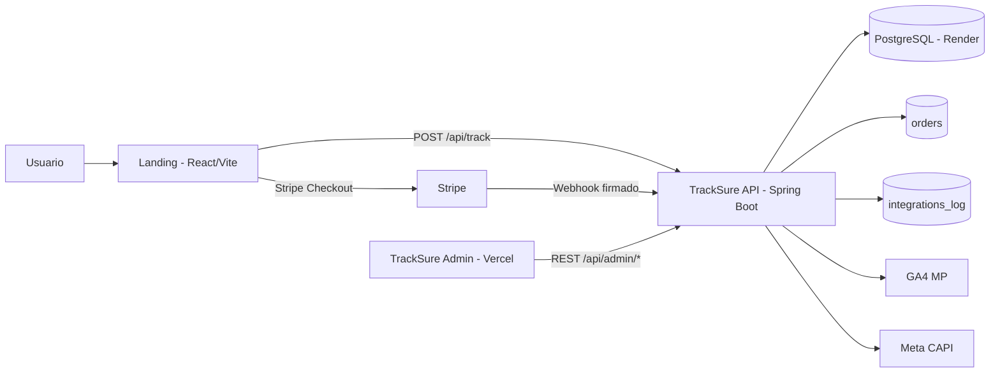

<p align="center">
  
</p>

# TrackSure - Revenue Attribution & Server-Side Conversion Tracking

TrackSure conecta navegacion, checkout y confirmacion de pago en un solo flujo auditable por `eventId`.  
El producto combina tracking en landing, procesamiento Stripe webhook idempotente, persistencia en PostgreSQL y observabilidad operativa en un dashboard admin.

## Problema que resuelve

En ecommerce y campanas pagas, la atribucion se rompe por varios motivos:

- El tracking solo browser-side pierde eventos por cookies, ITP y adblockers.
- Stripe redirige fuera del sitio y corta la trazabilidad del funnel.
- Sin correlacion sesion-evento-pago no se puede saber que campana genero revenue real.
- Los equipos de growth y operaciones no tienen auditoria tecnica de punta a punta.

## Como lo resuelve TrackSure

- Genera y conserva un `eventId` para correlacionar todo el flujo.
- Registra eventos de funnel (`landing_view`, `click_cta`, `begin_checkout`, `purchase`).
- Procesa webhooks Stripe con validacion de firma e idempotencia.
- Normaliza el estado de negocio en `orders.business_status`.
- Envia conversion server-side a GA4 MP y Meta CAPI.
- Expone consultas admin para auditoria por sesion, evento, orden e integraciones.

## Arquitectura



## Decisiones tecnicas clave

| Decision | Por que importa |
|---|---|
| Tracking server-side con `eventId` | Mantiene correlacion estable entre sesiones, eventos y pagos. |
| Stripe webhook idempotente (`stripe_event_id` PK) | Evita doble procesamiento y ordenes duplicadas. |
| `orders.business_status` canonico | Simplifica reporting operativo (`SUCCESS`, `PENDING`, `FAILED`, `UNKNOWN`). |
| Flyway para migraciones | Controla cambios de esquema por version y permite rollback operativo. |
| `integrations_log` para auditoria | Guarda request/response y estado de envios a GA4 MP y Meta CAPI. |
| Separacion `tracking_session` / `tracking_event` / `orders` | Mantiene modelo claro entre atribucion, comportamiento y revenue. |
| Backend + PostgreSQL en Render | Despliegue estable con endpoint publico para webhooks Stripe. |

## Endpoints principales

| Metodo | Endpoint | Proposito | Seguridad |
|---|---|---|---|
| `POST` | `/api/track` | Registra evento de funnel y mantiene `tracking_session`/`tracking_event`. | Publico + rate limit |
| `POST` | `/api/stripe/webhook` | Procesa webhook Stripe, actualiza `orders` y dispara integraciones. | Publico + firma Stripe |
| `GET` | `/api/admin/health` | Health de autenticacion admin. | Basic Auth (`ADMIN`) |
| `GET` | `/api/admin/sessions` | Lista sesiones con filtros y paginacion. | Basic Auth (`ADMIN`) |
| `GET` | `/api/admin/sessions/{eventId}` | Trazabilidad completa por `eventId`. | Basic Auth (`ADMIN`) |
| `GET` | `/api/admin/events` | Lista eventos con filtros y paginacion. | Basic Auth (`ADMIN`) |
| `GET` | `/api/admin/metrics` | KPIs agregados para dashboard. | Basic Auth (`ADMIN`) |
| `GET` | `/api/health/db` | Estado de conexion a PostgreSQL. | Publico |
| `GET` | `/actuator/health` | Health endpoint de plataforma. | Publico |

Swagger no esta habilitado en el deploy actual.

## Base de datos

- Motor: PostgreSQL (Render).
- Versionado de esquema: Flyway (`backend/src/main/resources/db/migration`).
- Fuente de verdad del modelo: [`infra/modelo_bdd.md`](./infra/modelo_bdd.md).
- Tablas core: `tracking_session`, `tracking_event`, `orders`, `stripe_webhook_event`, `integrations_log`.

## Setup local

### Requisitos

- Java 17+
- Maven 3.9+
- Node.js 20+
- PostgreSQL local disponible

### Backend (`/backend`)

```bash
cd backend
mvn spring-boot:run
```

Variables de entorno soportadas:

1. Opcion recomendada (`SPRING_DATASOURCE_URL` + credenciales)
2. Opcion fallback (`PGHOST`, `PGPORT`, `PGDATABASE`, `PGUSER`, `PGPASSWORD`)

Ejemplo:

```bash
SPRING_DATASOURCE_URL=jdbc:postgresql://localhost:5432/app_db
SPRING_DATASOURCE_USERNAME=postgres
SPRING_DATASOURCE_PASSWORD=postgres
```

Ejemplo `application.yml`:

```yaml
spring:
  datasource:
    url: ${SPRING_DATASOURCE_URL:jdbc:postgresql://${PGHOST:localhost}:${PGPORT:5432}/${PGDATABASE:app_db}}
    username: ${SPRING_DATASOURCE_USERNAME:${PGUSER:postgres}}
    password: ${SPRING_DATASOURCE_PASSWORD:${PGPASSWORD:postgres}}
```

### Landing (`/frontend/landing`)

```bash
cd frontend/landing
npm install
npm run dev
```

`.env` esperado:

```bash
VITE_API_URL=http://localhost:8080
VITE_STRIPE_PAYMENT_LINK=https://buy.stripe.com/...
```

### Admin (`/frontend/admin`)

```bash
cd frontend/admin
npm install
npm run dev
```

`.env` esperado:

```bash
VITE_API_URL=http://localhost:8080
```

## Despliegue

### Render (backend + DB)

- Web Service conectado al repositorio GitHub.
- Base PostgreSQL provisionada en Render.
- Variables configuradas en dashboard Render (`SPRING_DATASOURCE_URL`, `SPRING_DATASOURCE_USERNAME`, `SPRING_DATASOURCE_PASSWORD`, `ADMIN_USER`, `ADMIN_PASS`, `STRIPE_WEBHOOK_SECRET`, etc.).
- Stripe webhook debe apuntar a:
  - `https://<backend-render>/api/stripe/webhook`

### Vercel (frontends)

- `frontend/landing` y `frontend/admin` desplegados como proyectos separados.
- `VITE_API_URL` debe apuntar al backend en Render.

## URLs de referencia

| Recurso | URL |
|---|---|
| Landing | https://s02-26-equipo-15-web-app-developmen.vercel.app/ |
| Admin | https://s02-26-equipo-15-web-app-admin.vercel.app/admin/login |
| API | https://s02-26-equipo-15-web-app-development.onrender.com |
| API Health | https://s02-26-equipo-15-web-app-development.onrender.com/actuator/health |

## Documentacion por modulo

- [`backend/README.md`](./backend/README.md)
- [`frontend/landing/README.md`](./frontend/landing/README.md)
- [`frontend/admin/README.md`](./frontend/admin/README.md)
- [`BDD/README.md`](./BDD/README.md)
- [`infra/README.md`](./infra/README.md)
