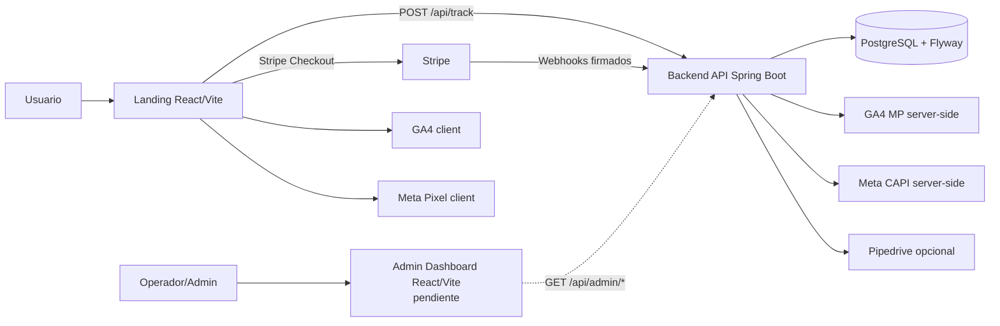
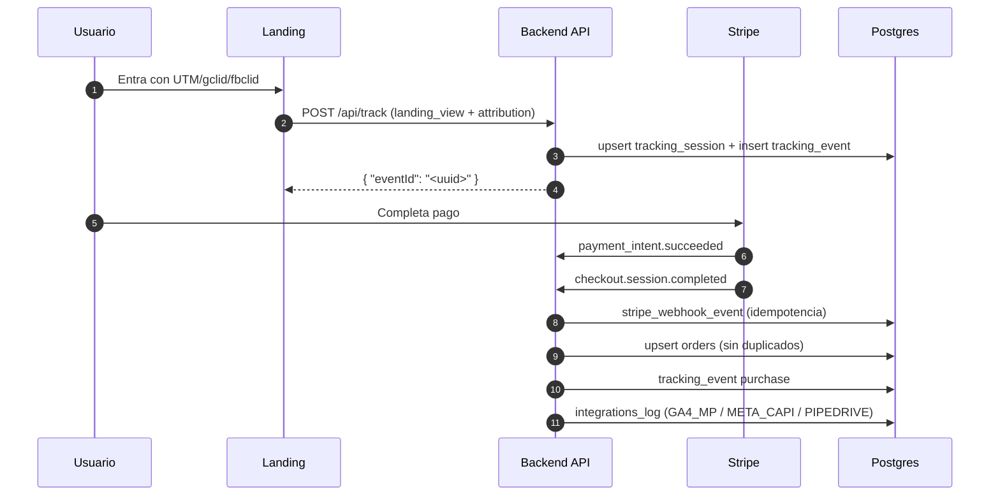
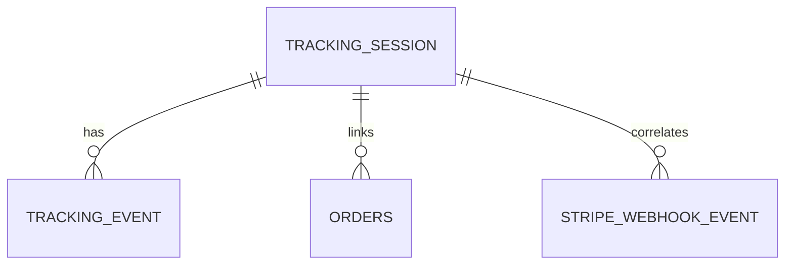
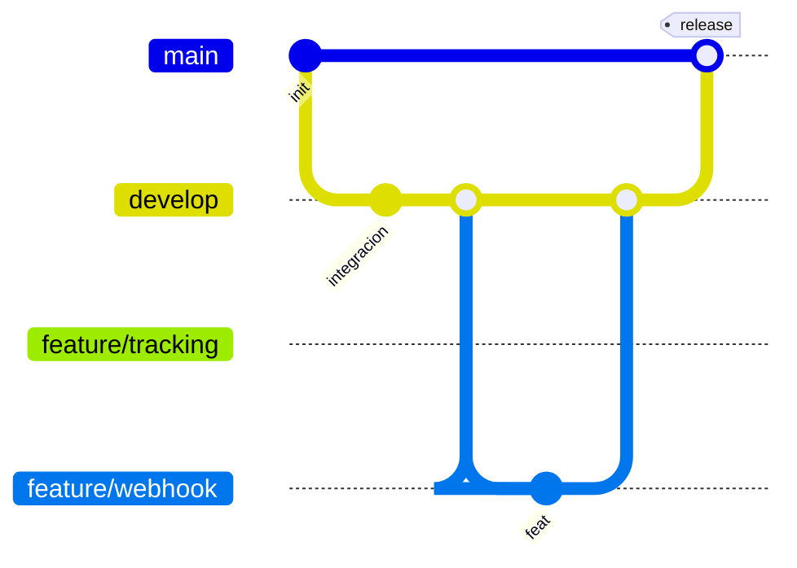

# S02-26-Equipo-15 | Web App Development

Monorepo del equipo 15 para conversion tracking y pagos con Stripe.

## Objetivo del proyecto

Construir una plataforma con:

- Landing de conversion (React + Vite)
- Backend de tracking/pagos (Spring Boot + PostgreSQL)
- Integraciones server-side (GA4 MP, Meta CAPI, Pipedrive opcional)
- Panel administrador para consulta de datos (pendiente de desarrollo frontend)

## Estado actual de modulos

- `backend/`: implementado y operativo
- `frontend/landing/`: implementado y operativo
- `frontend/admin/`: pendiente de desarrollo (planificado)
- `infra/`: documentacion tecnica actualizada

## Arquitectura del proyecto

```text
/
|-- backend/                 # API - Spring Boot 3 / Java 17
|-- frontend/
|   |-- landing/             # Landing + Checkout (React + Vite)
|   `-- admin/               # Panel Administrador (pendiente)
|-- infra/                   # Documentacion de arquitectura y modelo de datos
|-- BDD/                     # Material de apoyo historico
`-- README.md
```

## Arquitectura end-to-end



## Flujo transaccional



## Endpoints backend

- `POST /api/track`
- `POST /api/stripe/webhook`
- `GET /api/admin/sessions`
- `GET /api/admin/sessions/{eventId}`
- `GET /api/admin/events`
- `GET /api/admin/metrics`
- `GET /api/health/db`
- `GET /actuator/health`

## Modelo de datos (resumen)



Tablas activas:

- `tracking_session`
- `tracking_event`
- `orders`
- `stripe_webhook_event`
- `integrations_log`

## Flujo de ramas Git



## Variables de entorno clave

### Backend (`backend/.env.example`)

- `SPRING_PROFILES_ACTIVE`
- `SPRING_DATASOURCE_URL`
- `SPRING_DATASOURCE_USERNAME`
- `SPRING_DATASOURCE_PASSWORD`
- `STRIPE_WEBHOOK_SECRET`
- `TRACKING_ENABLED`
- `META_CAPI_ENABLED`
- `META_PIXEL_ID`
- `META_ACCESS_TOKEN`
- `GA4_MP_ENABLED`
- `GA4_MEASUREMENT_ID`
- `GA4_API_SECRET`
- `GA4_MP_DEBUG_VALIDATION_ENABLED`
- `PIPEDRIVE_ENABLED`
- `PIPEDRIVE_API_TOKEN`
- `CORS_ALLOWED_ORIGINS`

### Landing (`frontend/landing/.env.example`)

- `VITE_STRIPE_PAYMENT_LINK`
- `VITE_API_URL`
- `VITE_GA_MEASUREMENT_ID`
- `VITE_META_PIXEL_ID`

## Ejecucion local

### Backend

```bash
cd backend
mvn spring-boot:run
```

### Landing

```bash
cd frontend/landing
npm install
npm run dev
```

## Documentacion complementaria

- `backend/README.md`
- `frontend/landing/README.md`
- `infra/arquitectura_end-to-end.md`
- `infra/modelo_bdd.md`
- `infra/resumen_end_to_end.md`
