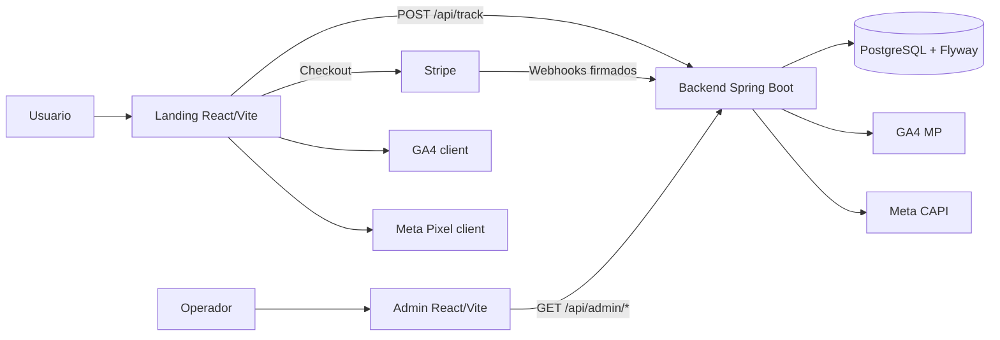
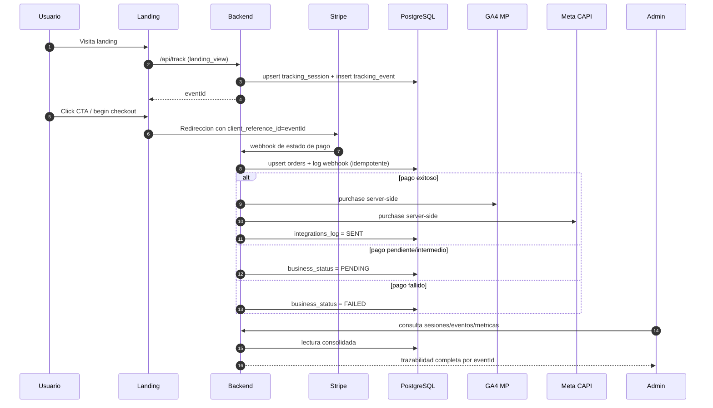

<p align="center">
  
</p>

# NoCountry Growth Observability Platform

Plataforma para attribution y conversion server-side: captura trafico con contexto de campana, correlaciona pagos Stripe con `eventId` y expone trazabilidad operativa en un panel admin con metricas de negocio.

## Estado actual / MVP

- [x] Landing (`frontend/landing`): captura UTM y dispara eventos de funnel.
- [x] Admin panel (`frontend/admin`): consulta sesiones, eventos, ordenes y estado de integraciones.
- [x] Backend API (`backend`): tracking, Stripe webhook idempotente, auth admin Basic.
- [x] Base de datos (`BDD` + Flyway): esquema versionado para `tracking_session`, `tracking_event`, `orders`, `stripe_webhook_event`, `integrations_log`.

## Componentes

- Landing: [`frontend/landing`](./frontend/landing)
- Admin panel: [`frontend/admin`](./frontend/admin)
- Backend API: [`backend`](./backend)
- Base de datos + esquema: [`BDD`](./BDD)

## Arquitectura de alto nivel



## Flujo de negocio y datos



## Links

| Recurso | URL |
|---|---|
| Landing deploy | https://s02-26-equipo-15-web-app-developmen.vercel.app/ |
| Admin deploy | https://s02-26-equipo-15-web-app-admin.vercel.app/admin/login |
| API base URL | https://s02-26-equipo-15-web-app-development-desarrollo.up.railway.app |
| Health check | https://s02-26-equipo-15-web-app-development-desarrollo.up.railway.app/actuator/health |
| Swagger | No habilitado en deploy actual |

## Levantar en local

```bash
# Backend (http://localhost:8080)
cd backend
mvn spring-boot:run

# Landing (http://localhost:5173)
cd ../frontend/landing
npm install
npm run dev

# Admin (http://localhost:5174 o puerto libre de Vite)
cd ../admin
npm install
npm run dev
```

## Integraciones

- Stripe webhook: procesamiento idempotente por `stripeEventId` y actualizacion de `orders.business_status`.
- GA4 Measurement Protocol: envio server-side de `purchase` cuando corresponde.
- Meta CAPI: envio server-side de conversion para consistencia de atribucion.
- Pipedrive: integracion existente por feature flag (`PIPEDRIVE_ENABLED`), deshabilitada por defecto hasta contar con token y definicion final de pipeline comercial.

## KPIs / metricas del dashboard

- Sesiones y eventos por rango.
- Ordenes y revenue.
- Distribucion de `orders.business_status` (`SUCCESS`, `PENDING`, `FAILED`, `UNKNOWN`).
- Conversion del funnel (`landing_view`, `click_cta`, `begin_checkout`, `purchase`).
- Estado de `Integrations log` por `eventId`.

## Roadmap

- Endurecer observabilidad operativa y alertas de webhooks/integraciones.
- Incorporar pruebas E2E de checkout y trazabilidad completa.
- Cerrar rollout de Pipedrive en produccion.

## Documentacion por modulo

- [`backend/README.md`](./backend/README.md)
- [`frontend/landing/README.md`](./frontend/landing/README.md)
- [`frontend/admin/README.md`](./frontend/admin/README.md)
- [`BDD/README.md`](./BDD/README.md)
- [`infra/arquitectura_end-to-end.md`](./infra/arquitectura_end-to-end.md)
