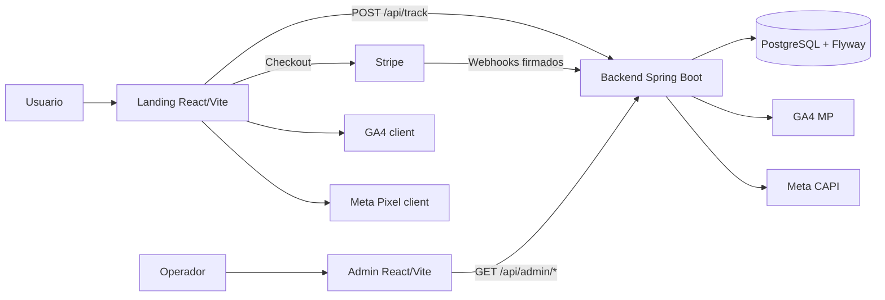
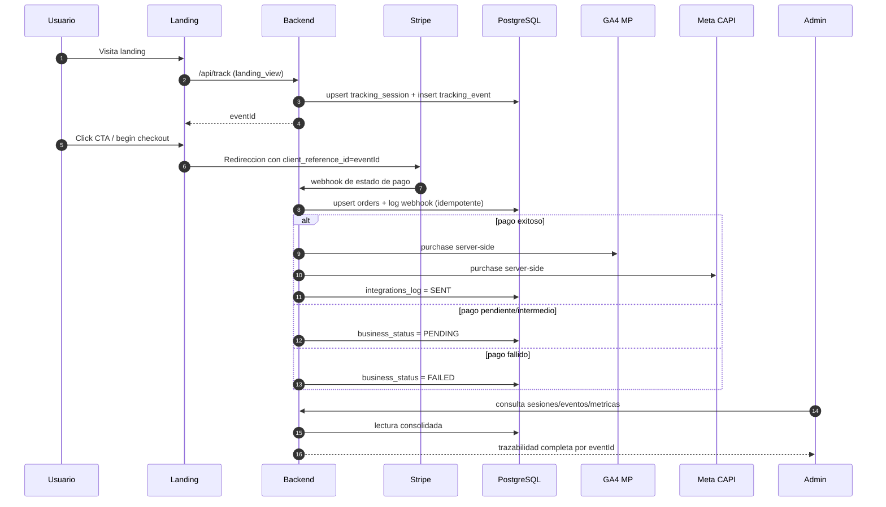

<p align="center">
  
</p>

# NoCountry Growth Observability Platform

Plataforma end-to-end para convertir trafico en ventas medibles, uniendo marketing attribution, pagos en Stripe y trazabilidad operativa en un panel admin.

## Resumen ejecutivo

Este proyecto resuelve un problema real de growth y operacion:

- Captura demanda (Google/Meta) con contexto de campana.
- Correlaciona todo con un `eventId` unico desde landing hasta pago.
- Confirma conversiones con datos de servidor (GA4 MP y Meta CAPI), no solo con pixel cliente.
- Expone trazabilidad auditable para negocio, producto y operaciones.

En una frase: pasamos de "clicks sin contexto" a "ingresos explicables por sesion".

## Problema de negocio

En funnels tradicionales, los equipos suelen tener:

- Datos fragmentados entre landing, Stripe y plataformas de anuncios.
- Dudas sobre que conversion es real vs estimada por pixel.
- Poco contexto para explicar por que sube o cae la conversion.

Esta plataforma cierra esa brecha con una capa de observabilidad de conversion orientada a decisiones de negocio.

## Propuesta de valor para NotCountry

- Menor friccion comercial: medicion clara del journey completo.
- Mayor confianza: deduplicacion e idempotencia en pagos/webhooks.
- Mejor operacion: panel para auditar sesiones, eventos, estado de pago e integraciones.
- Escalabilidad: arquitectura modular con frontends separados y backend desacoplado.

## Arquitectura de alto nivel



## Flujo de negocio y datos



## Indicadores clave (KPI)

- Funnel principal: `landing_view -> click_cta -> begin_checkout -> purchase`
- Tasa de conversion por fuente de campana
- Revenue confirmado por rango de fechas
- Distribucion de estado de negocio: `SUCCESS | PENDING | FAILED | UNKNOWN`
- Estado de integraciones: `GA4_MP` y `META_CAPI`

## Estado del MVP

Completado y operativo:

- Landing con tracking de atribucion.
- Backend con Stripe webhook e idempotencia.
- Integracion server-side con GA4 MP y Meta CAPI.
- Admin con sesiones, eventos, metricas y trazabilidad.
- Modelo de datos versionado con Flyway.

Siguiente foco recomendado:

- Hardening de auth/admin.
- Alertas y observabilidad operativa.
- Pruebas E2E automatizadas de checkout y webhooks.

## Estructura del repositorio

```text
/
|-- backend/                 # API Spring Boot (Java 17)
|-- frontend/
|   |-- landing/             # Landing de conversion
|   `-- admin/               # Panel observability
|-- infra/                   # Arquitectura y diagramas
|-- BDD/                     # Modelo de datos y scripts SQL
`-- README.md
```

## Levantar en local

```bash
# Backend
cd backend
mvn spring-boot:run

# Landing
cd ../frontend/landing
npm install
npm run dev

# Admin
cd ../admin
npm install
npm run dev
```

## Documentacion por modulo

- `backend/README.md`
- `frontend/landing/README.md`
- `frontend/admin/README.md`
- `infra/arquitectura_end-to-end.md`
- `infra/modelo_bdd.md`
- `infra/resumen_end_to_end.md`
- `BDD/README.md`
- `BDD/descripcion_bdd.md`
