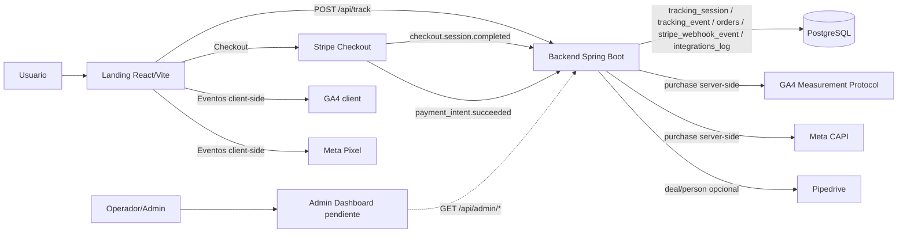
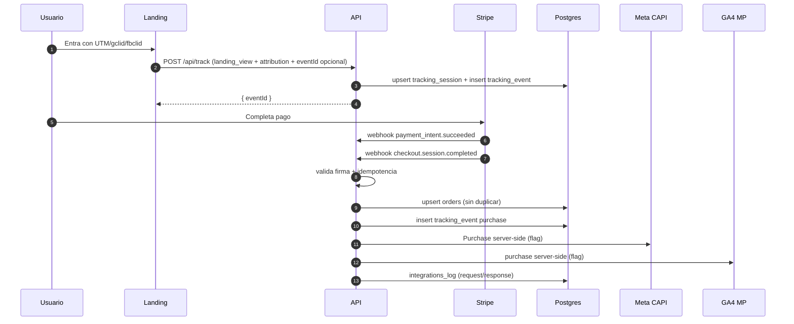

# Arquitectura End-to-End (Estado Actual)

## 1) Componentes

- Landing: React + Vite
- Admin Dashboard: React + Vite (pendiente de desarrollo frontend)
- Backend API: Spring Boot 3 / Java 17
- DB: PostgreSQL + Flyway
- Pago: Stripe Checkout + Webhooks firmados
- Tracking client-side: GA4 client, Meta Pixel client
- Tracking server-side: GA4 MP, Meta CAPI
- CRM opcional: Pipedrive

## 2) Diagrama de arquitectura

## 3) Flujo transaccional

## 4) Endpoints activos

- `POST /api/track`
- `POST /api/stripe/webhook`
- `GET /api/admin/sessions`
- `GET /api/admin/sessions/{eventId}`
- `GET /api/admin/events`
- `GET /api/admin/metrics`
- `GET /api/health/db`
- `GET /actuator/health`

## 5) Controles operativos

- Idempotencia de evento de tracking: `tracking_event.id` deterministico por `eventId|eventType`
- Idempotencia Stripe webhook: `stripe_webhook_event.stripe_event_id` (PK)
- Anti-duplicado de orden:
  - `orders.stripe_session_id` (UNIQUE)
  - `orders.payment_intent_id` (UNIQUE parcial)
- Correlacion de webhook con sesion: `stripe_webhook_event.event_id`
- Estado canonico de negocio: `orders.business_status`
- Rate limit in-memory por `ip_hash` en `/api/track`
- CORS configurable por `CORS_ALLOWED_ORIGINS`
- Errores uniformes: `{ "error", "message", "details" }`

## 6) Trazabilidad de integraciones

`integrations_log` guarda por envio:

- `integration`
- `reference_id` (normalmente `eventId`)
- `status` (`SENT|FAILED|SKIPPED|SENT_WITH_WARNINGS`)
- `http_status`
- `request_payload` (jsonb)
- `response_payload` (jsonb)

Nota: en Meta CAPI ya se persiste body de respuesta (ej. `events_received`, `fbtrace_id`).

## 7) Estado del esquema

Tablas activas:

- `tracking_session`
- `tracking_event`
- `orders`
- `stripe_webhook_event`
- `integrations_log`

Tablas legadas removidas por Flyway `V4__drop_legacy_tables.sql`.
