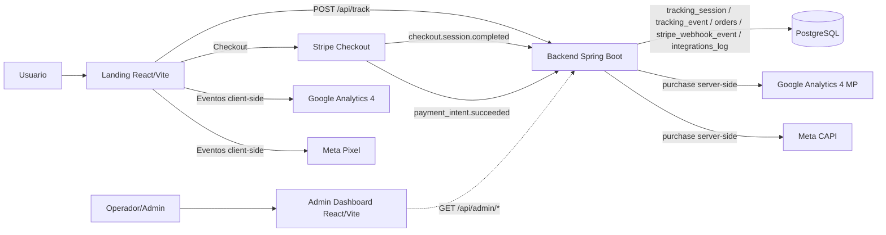
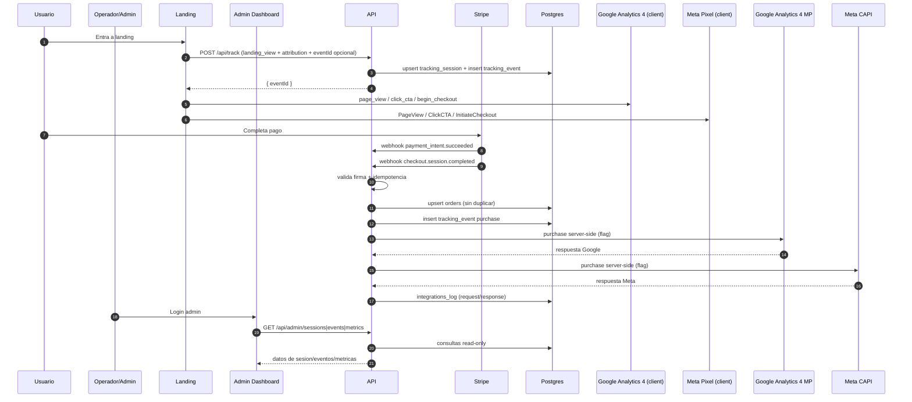

# Arquitectura End-to-End (Actualizado)

## 1) Componentes

- Landing: React + Vite
- Admin Dashboard: React + Vite + TypeScript (operativo)
- Backend API: Spring Boot 3 / Java 17
- DB: PostgreSQL + Flyway
- Pago: Stripe Checkout + webhooks firmados
- Tracking client-side: Google Analytics 4 (GA4) y Meta Pixel
- Tracking server-side: Google Analytics 4 MP (GA4 MP) y Meta CAPI

## 2) Diagrama de arquitectura

## 3) Flujo transaccional

## 4) Endpoints activos

- `POST /api/track`
- `POST /api/stripe/webhook`
- `GET /api/admin/sessions`
- `GET /api/admin/sessions/{eventId}`
- `GET /api/admin/events`
- `GET /api/admin/metrics`
- `GET /api/health/db`
- `GET /actuator/health`

## 5) Controles operativos

- Idempotencia de tracking: `tracking_event.id` deterministico por `eventId|eventType`.
- Idempotencia de webhook Stripe: `stripe_webhook_event.stripe_event_id` (PK).
- Anti-duplicado de orden:
  - `orders.stripe_session_id` (UNIQUE)
  - `orders.payment_intent_id` (UNIQUE parcial)
- Correlacion de webhook con sesion: `stripe_webhook_event.event_id`.
- Estado canonico de negocio: `orders.business_status`.
- Rate limit in-memory por `ip_hash` en `/api/track`.
- CORS configurable por `CORS_ALLOWED_ORIGINS`.
- Errores uniformes: `{ "error", "message", "details" }`.

## 6) Trazabilidad de integraciones

`integrations_log` guarda por envio:

- `integration`
- `reference_id` (normalmente `eventId`)
- `status` (`SENT|FAILED|SKIPPED|SENT_WITH_WARNINGS`)
- `http_status`
- `request_payload` (jsonb)
- `response_payload` (jsonb)

Notas:

- En Meta CAPI se persiste body de respuesta (ej. `events_received`, `fbtrace_id`).
- En Google Analytics 4 MP se persiste estado HTTP y detalle de validacion cuando aplica.

## 7) Estado del esquema

Tablas activas:

- `tracking_session`
- `tracking_event`
- `orders`
- `stripe_webhook_event`
- `integrations_log`

Tablas legadas removidas por Flyway `V4__drop_legacy_tables.sql`.

## 8) Validacion del objetivo del proyecto

Estado general: `cumplido a nivel MVP funcional`.

Cumplido:

- Tracking completo del funnel en landing.
- Correlacion de pago por `eventId` entre landing, Stripe y backend.
- Registro de compra y deduplicacion de ordenes/webhooks.
- Envio server-side a Google Analytics 4 MP y Meta CAPI con auditoria.
- Dashboard admin operativo para monitoreo de sesiones, eventos y metricas.

Pendiente para cierre productivo:

- Endurecer autenticacion/autorizacion del admin.
- Ampliar pruebas E2E y pruebas de carga.
- Fortalecer observabilidad (alertas, dashboards y SLOs).
- Definir runbook de despliegue/rollback y checklist post-deploy.
