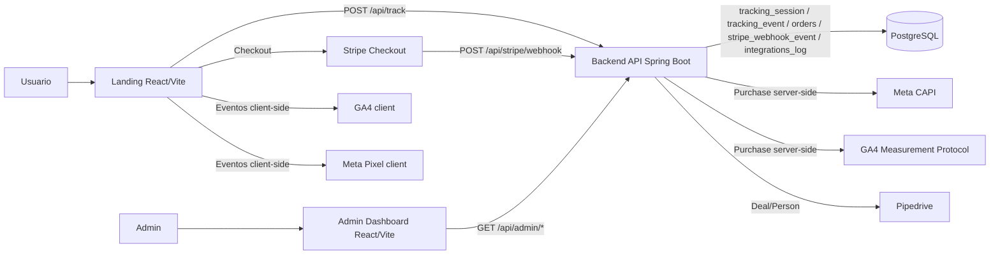
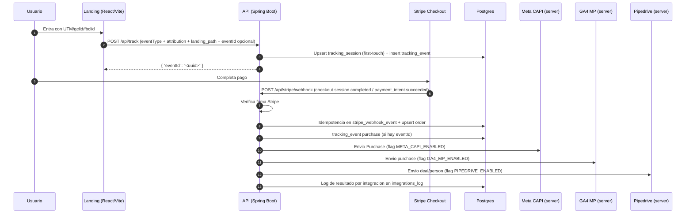

# Arquitectura End-to-End (Estado Actual)

## 1. Componentes
- **Landing**: React + Vite (Vercel)
- **Admin Dashboard**: React + Vite (Vercel)
- **Backend API**: Spring Boot 3 / Java 17 (Railway)
- **Base de datos**: PostgreSQL + Flyway (Railway)
- **Pagos**: Stripe Checkout + Webhook firmado
- **Tracking client-side**: GA4 (client), Meta Pixel (client)
- **Tracking server-side**: Meta CAPI, GA4 Measurement Protocol
- **CRM opcional**: Pipedrive

## 2. Diagrama de arquitectura

## 3. Flujo transaccional real

## 4. Endpoints backend activos
- `POST /api/track`
- `POST /api/stripe/webhook`
- `GET /api/admin/sessions`
- `GET /api/admin/sessions/{eventId}`
- `GET /api/admin/events`
- `GET /api/admin/metrics`
- `GET /api/health/db`
- `GET /actuator/health`

## 5. Controles operativos
- **Idempotencia track**: `tracking_event.id = UUID(nameUUID(eventId|eventType))`
- **Idempotencia webhook**: `stripe_webhook_event.stripe_event_id` (PK)
- **No duplicar orden**: `orders.stripe_session_id` (UNIQUE)
- **Rate limit**: token bucket in-memory por `ip_hash` en `/api/track`
- **Errores uniformes**: `{"error","message","details"}`
- **CORS configurable**: `CORS_ALLOWED_ORIGINS` (sin `*` en `prod`)

## 6. Estado de esquema
- El modelo legado (`users`, `attributions`, `landing_events`, `payments`) fue retirado por migracion Flyway `V4__drop_legacy_tables.sql`.
- El flujo end-to-end de esta arquitectura usa solo:
  - `tracking_session`
  - `tracking_event`
  - `orders`
  - `stripe_webhook_event`
  - `integrations_log`
