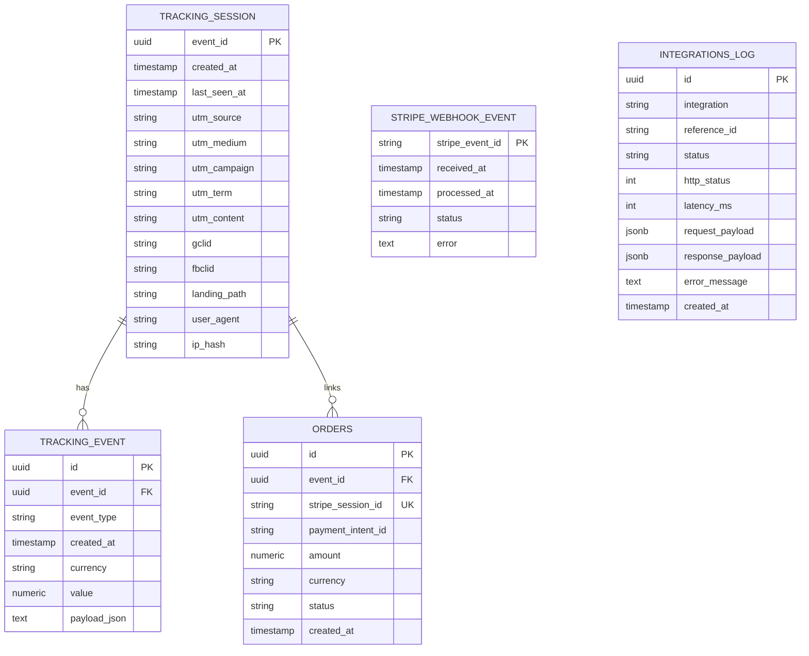

# Modelo BDD (Estado Actual)

## 1. Esquema relacional


## 2. Reglas de negocio en base de datos
- `orders.stripe_session_id` tiene unique index para evitar duplicados de pago.
- `stripe_webhook_event.stripe_event_id` garantiza idempotencia por evento Stripe.
- `tracking_event.id` se usa como clave idempotente por combinacion `eventId + eventType`.
- `integrations_log.reference_id` guarda el `eventId` (relacion logica, no FK fisica).

## 3. Indices relevantes
- `idx_tracking_event_event_id`
- `idx_tracking_event_created_at`
- `idx_tracking_event_type`
- `idx_tracking_session_created_at`
- `ux_orders_stripe_session_id`
- `idx_orders_event_id`
- `idx_orders_created_at`
- `idx_integrations_log_created_at`
- `idx_integrations_log_integration`
- `idx_integrations_log_reference_id`

## 4. Migraciones Flyway
- `V1__init.sql`: tablas core (`tracking_session`, `tracking_event`, `orders`, `stripe_webhook_event`) + indices.
- `V2__integrations_log.sql`: crea `integrations_log`.
- `V3__normalize_integrations_log_jsonb.sql`: normaliza `request_payload` y `response_payload` a `jsonb`.

## 5. Consultas de verificacion rapida
```sql
-- Webhooks Stripe procesados/fallidos
SELECT stripe_event_id, status, error, received_at, processed_at
FROM stripe_webhook_event
ORDER BY received_at DESC
LIMIT 20;

-- Ordenes registradas
SELECT id, event_id, stripe_session_id, payment_intent_id, amount, currency, status, created_at
FROM orders
ORDER BY created_at DESC
LIMIT 20;

-- Purchase en tracking
SELECT id, event_id, event_type, value, currency, created_at
FROM tracking_event
WHERE event_type = 'purchase'
ORDER BY created_at DESC
LIMIT 20;

-- Resultado de integraciones server-side
SELECT integration, reference_id, status, http_status, latency_ms, error_message, created_at
FROM integrations_log
ORDER BY created_at DESC
LIMIT 50;
```
