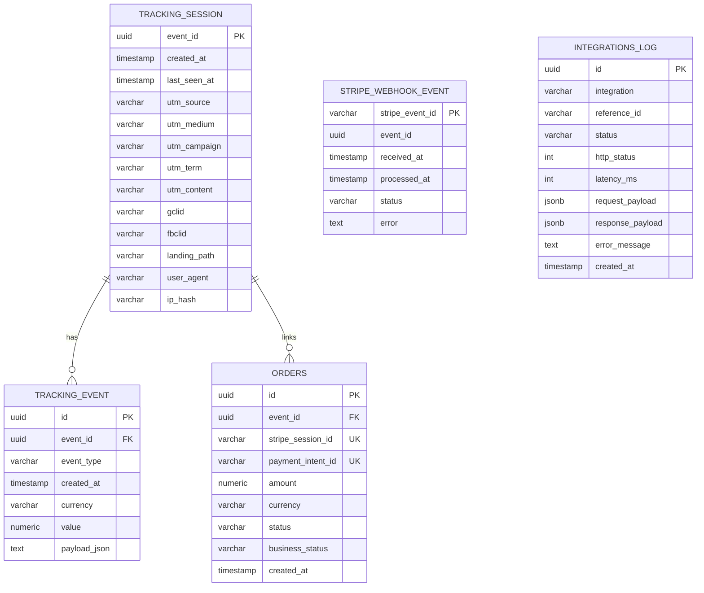
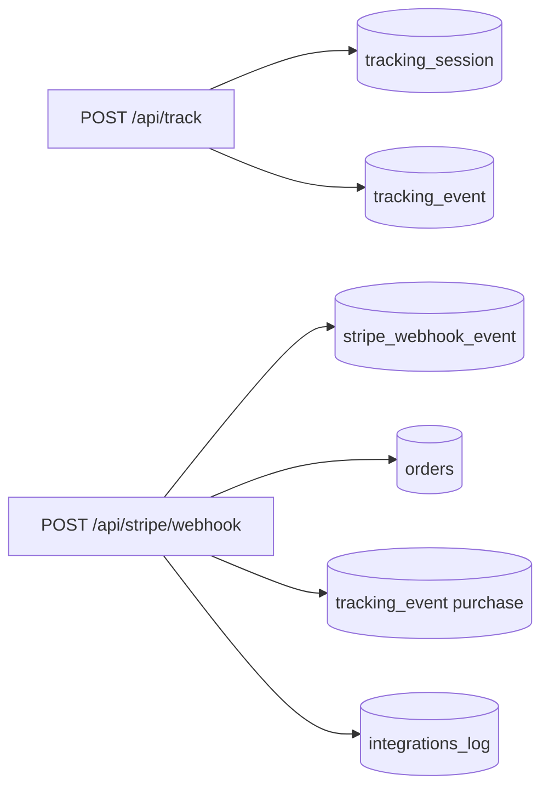

# Modelo BDD

Documento alineado al esquema actual en Flyway.
La fuente de verdad del modelo de produccion es `backend/src/main/resources/db/migration`.

## 1) Modelo relacional (ERD)



## 2) Flujo de datos operativo



Notas:

- `stripe_webhook_event.event_id` es correlacion logica (no FK en DB).
- `integrations_log.reference_id` es correlacion logica (normalmente `eventId`, y como fallback puede ser `stripe_session_id`).
- En DB real, `orders.payment_intent_id` es unique parcial (`WHERE payment_intent_id IS NOT NULL`).
- Es normal ver mas de una fila en `stripe_webhook_event` para un mismo `event_id`: son distintos eventos de Stripe (ids diferentes).

## 3) Diccionario de tablas

### `tracking_session`

Tabla de sesion/attribution por `event_id` (first-touch + metadata tecnica).

| Columna | Tipo | Nulo | Regla |
|---|---|---|---|
| `event_id` | `uuid` | No | PK |
| `created_at` | `timestamp` | No | primera vez vista |
| `last_seen_at` | `timestamp` | No | ultima actividad |
| `utm_source` | `varchar(255)` | Si | first-touch |
| `utm_medium` | `varchar(255)` | Si | first-touch |
| `utm_campaign` | `varchar(255)` | Si | first-touch |
| `utm_term` | `varchar(255)` | Si | first-touch |
| `utm_content` | `varchar(255)` | Si | first-touch |
| `gclid` | `varchar(255)` | Si | click id Google Ads |
| `fbclid` | `varchar(255)` | Si | click id Meta |
| `landing_path` | `varchar(1024)` | Si | ruta de entrada |
| `user_agent` | `varchar(1024)` | Si | metadata request |
| `ip_hash` | `varchar(64)` | Si | hash de IP |

### `tracking_event`

Eventos de tracking (landing, cta, checkout y purchase).

| Columna | Tipo | Nulo | Regla |
|---|---|---|---|
| `id` | `uuid` | No | PK, idempotencia por `eventId|eventType` |
| `event_id` | `uuid` | No | FK a `tracking_session(event_id)` |
| `event_type` | `varchar(64)` | No | `landing_view`, `click_cta`, `begin_checkout`, `purchase` |
| `created_at` | `timestamp` | No | fecha de registro |
| `currency` | `varchar(16)` | Si | para compra |
| `value` | `numeric` | Si | para compra |
| `payload_json` | `text` | Si | payload serializado |

### `orders`

Ordenes derivadas de webhooks de Stripe.

| Columna | Tipo | Nulo | Regla |
|---|---|---|---|
| `id` | `uuid` | No | PK |
| `event_id` | `uuid` | Si | FK a `tracking_session(event_id)` |
| `stripe_session_id` | `varchar(255)` | No | UNIQUE |
| `payment_intent_id` | `varchar(255)` | Si | UNIQUE parcial (`IS NOT NULL`) |
| `amount` | `numeric` | No | monto |
| `currency` | `varchar(16)` | No | moneda |
| `status` | `varchar(64)` | No | estado Stripe crudo (`PAID`, `SUCCEEDED`, `UNPAID`, etc.) |
| `business_status` | `varchar(32)` | No | `SUCCESS`, `PENDING`, `FAILED`, `UNKNOWN` |
| `created_at` | `timestamp` | No | fecha de alta |

### `stripe_webhook_event`

Bitacora de procesamiento de webhooks.

| Columna | Tipo | Nulo | Regla |
|---|---|---|---|
| `stripe_event_id` | `varchar(255)` | No | PK, idempotencia webhook |
| `event_id` | `uuid` | Si | correlacion con sesion/orden |
| `received_at` | `timestamp` | No | recibido |
| `processed_at` | `timestamp` | Si | procesado |
| `status` | `varchar(32)` | No | `RECEIVED`, `PROCESSED`, `FAILED` |
| `error` | `text` | Si | detalle si falla |

### `integrations_log`

Auditoria de integraciones server-side.

| Columna | Tipo | Nulo | Regla |
|---|---|---|---|
| `id` | `uuid` | No | PK |
| `integration` | `varchar(64)` | No | `META_CAPI`, `GA4_MP`, `PIPEDRIVE` |
| `reference_id` | `varchar(255)` | Si | correlacion (`eventId` u otra clave) |
| `status` | `varchar(32)` | No | `SENT`, `FAILED`, `SKIPPED`, `SENT_WITH_WARNINGS` |
| `http_status` | `int` | Si | codigo HTTP |
| `latency_ms` | `int` | Si | latencia |
| `request_payload` | `jsonb` | Si | request persistida |
| `response_payload` | `jsonb` | Si | response persistida |
| `error_message` | `text` | Si | error resumido |
| `created_at` | `timestamp` | No | fecha de log |

## 4) Reglas de integridad e idempotencia

- `tracking_event.id` evita duplicados por evento logico (`eventId|eventType`).
- `stripe_webhook_event.stripe_event_id` evita reprocesar el mismo webhook.
- `orders.stripe_session_id` evita duplicar orden por checkout session.
- `orders.payment_intent_id` (unique parcial) evita duplicar orden por payment intent.
- `orders.business_status` normaliza `status` de Stripe para uso de negocio.
- `integrations_log` registra cada intento de envio y su estado final (`SENT`, `SKIPPED`, `FAILED`, etc.).

## 5) Indices activos

- `idx_tracking_event_event_id`
- `idx_tracking_event_created_at`
- `idx_tracking_event_type`
- `idx_tracking_session_created_at`
- `ux_orders_stripe_session_id`
- `ux_orders_payment_intent_id` (parcial)
- `idx_orders_event_id`
- `idx_orders_created_at`
- `idx_orders_business_status`
- `idx_stripe_webhook_event_event_id`
- `idx_integrations_log_created_at`
- `idx_integrations_log_integration`
- `idx_integrations_log_reference_id`

## 6) Evolucion del esquema (Flyway)

- `V1__init.sql`: tablas base (`tracking_session`, `tracking_event`, `orders`, `stripe_webhook_event`) e indices iniciales.
- `V2__integrations_log.sql`: crea `integrations_log`.
- `V3__normalize_integrations_log_jsonb.sql`: migra payloads de texto a `jsonb`.
- `V4__drop_legacy_tables.sql`: elimina modelo legado (`users`, `attributions`, `landing_events`, `payments`).
- `V5__orders_payment_intent_unique.sql`: deduplica historico y crea unique parcial por `payment_intent_id`.
- `V6__stripe_webhook_event_add_event_id.sql`: agrega `event_id` a webhooks para correlacion.
- `V7__orders_add_business_status.sql`: agrega y normaliza `business_status`.
- `V8__orders_fix_requires_payment_method_business_status.sql`: corrige `REQUIRES_PAYMENT_METHOD` hacia `FAILED`.
- `V9__orders_unpaid_business_status_pending.sql`: ajusta `UNPAID` hacia `PENDING`.

## 7) SQL de verificacion operativa

```sql
-- Webhooks recientes
SELECT stripe_event_id, event_id, status, error, received_at, processed_at
FROM stripe_webhook_event
ORDER BY received_at DESC
LIMIT 20;

-- Ordenes recientes
SELECT id, event_id, stripe_session_id, payment_intent_id, status, business_status, amount, currency, created_at
FROM orders
ORDER BY created_at DESC
LIMIT 20;

-- Duplicados por payment_intent_id (debe dar 0 filas)
SELECT payment_intent_id, COUNT(*) AS c
FROM orders
WHERE payment_intent_id IS NOT NULL
GROUP BY payment_intent_id
HAVING COUNT(*) > 1;

-- Duplicados por stripe_session_id (debe dar 0 filas)
SELECT stripe_session_id, COUNT(*) AS c
FROM orders
GROUP BY stripe_session_id
HAVING COUNT(*) > 1;

-- Eventos purchase recientes
SELECT id, event_id, event_type, value, currency, created_at
FROM tracking_event
WHERE event_type = 'purchase'
ORDER BY created_at DESC
LIMIT 20;

-- Integraciones recientes
SELECT integration, reference_id, status, http_status, latency_ms, error_message, created_at
FROM integrations_log
ORDER BY created_at DESC
LIMIT 50;

-- Traza completa por event_id
WITH target AS (
  SELECT 'TU_EVENT_ID'::uuid AS event_id
)
SELECT 'session' AS section, ts.event_id::text AS ref, ts.created_at AS ts, NULL::text AS status
FROM tracking_session ts
JOIN target t ON ts.event_id = t.event_id
UNION ALL
SELECT 'event', te.event_type, te.created_at, NULL::text
FROM tracking_event te
JOIN target t ON te.event_id = t.event_id
UNION ALL
SELECT 'order', COALESCE(o.payment_intent_id, o.stripe_session_id), o.created_at, o.business_status
FROM orders o
JOIN target t ON o.event_id = t.event_id
UNION ALL
SELECT 'integration', il.integration, il.created_at, il.status
FROM integrations_log il
JOIN target t ON il.reference_id = t.event_id::text
UNION ALL
SELECT 'webhook', swe.stripe_event_id, swe.received_at, swe.status
FROM stripe_webhook_event swe
JOIN target t ON swe.event_id = t.event_id
ORDER BY ts DESC;
```
