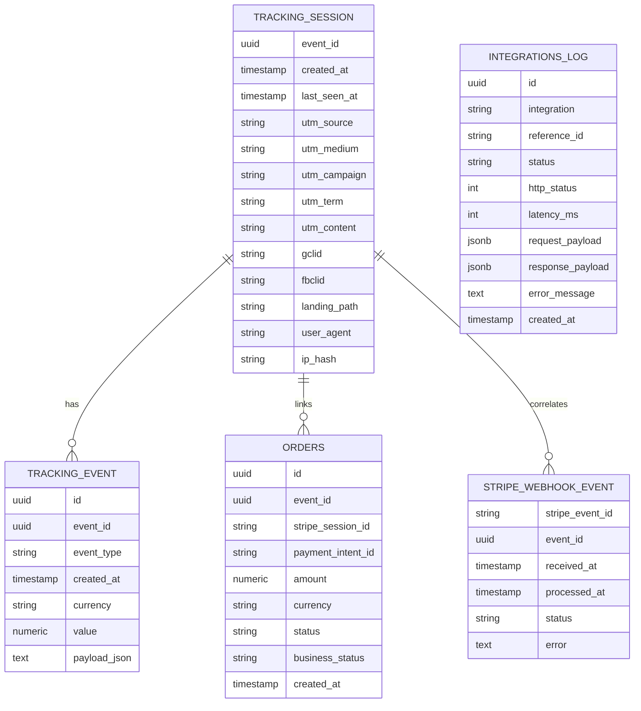

# Modelo BDD (Estado Actual)

## 1) Modelo relacional



## 2) Reglas de negocio en DB

- `tracking_session.event_id` es PK de sesion.
- `tracking_event.id` se usa como idempotencia por `eventId + eventType`.
- `tracking_event.event_id` referencia `tracking_session.event_id`.
- `orders.id` es PK.
- `orders.event_id` referencia `tracking_session.event_id`.
- `orders.stripe_session_id` es UNIQUE.
- `orders.payment_intent_id` tiene UNIQUE parcial (`IS NOT NULL`).
- `orders.business_status` normaliza estado de negocio:
  - `SUCCESS`
  - `PENDING`
  - `FAILED`
  - `UNKNOWN`
- `stripe_webhook_event.stripe_event_id` es PK (idempotencia por evento Stripe).
- `stripe_webhook_event.event_id` permite correlacion webhook -> sesion.
- `integrations_log.reference_id` guarda correlacion logica (normalmente `eventId`).

## 3) Indices relevantes

- `idx_tracking_event_event_id`
- `idx_tracking_event_created_at`
- `idx_tracking_event_type`
- `idx_tracking_session_created_at`
- `ux_orders_stripe_session_id`
- `ux_orders_payment_intent_id` (parcial)
- `idx_orders_event_id`
- `idx_orders_created_at`
- `idx_orders_business_status`
- `idx_stripe_webhook_event_event_id`
- `idx_integrations_log_created_at`
- `idx_integrations_log_integration`
- `idx_integrations_log_reference_id`

## 4) Migraciones Flyway

- `V1__init.sql`: tablas core + indices base.
- `V2__integrations_log.sql`: crea `integrations_log`.
- `V3__normalize_integrations_log_jsonb.sql`: payloads a `jsonb`.
- `V4__drop_legacy_tables.sql`: elimina tablas legadas.
- `V5__orders_payment_intent_unique.sql`: dedup historico + unique parcial.
- `V6__stripe_webhook_event_add_event_id.sql`: agrega `event_id` en webhook.
- `V7__orders_add_business_status.sql`: agrega `business_status`.

## 5) SQL de verificacion

```sql
-- 1) Stripe webhook
SELECT stripe_event_id, event_id, status, error, received_at, processed_at
FROM stripe_webhook_event
ORDER BY received_at DESC
LIMIT 20;

-- 2) Ordenes
SELECT id, event_id, stripe_session_id, payment_intent_id, status, business_status, amount, currency, created_at
FROM orders
ORDER BY created_at DESC
LIMIT 20;

-- 3) Duplicados por payment intent (debe quedar vacio)
SELECT payment_intent_id, COUNT(*) c
FROM orders
WHERE payment_intent_id IS NOT NULL
GROUP BY payment_intent_id
HAVING COUNT(*) > 1;

-- 4) Duplicados por stripe session (debe quedar vacio)
SELECT stripe_session_id, COUNT(*) c
FROM orders
GROUP BY stripe_session_id
HAVING COUNT(*) > 1;

-- 5) Purchase tracking
SELECT id, event_id, event_type, value, currency, created_at
FROM tracking_event
WHERE event_type = 'purchase'
ORDER BY created_at DESC
LIMIT 20;

-- 6) Integraciones server-side
SELECT integration, reference_id, status, http_status, error_message, created_at
FROM integrations_log
ORDER BY created_at DESC
LIMIT 50;
```
