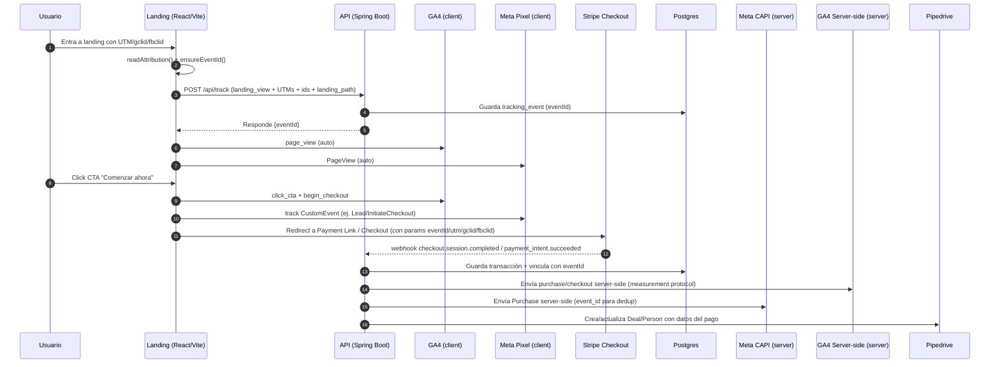
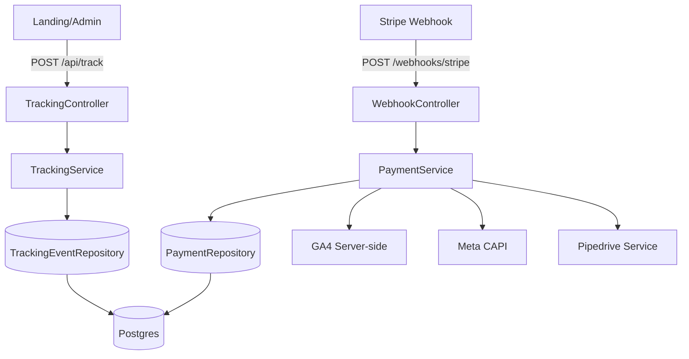

# Resumen End-to-End del Proyecto

## 1. Objetivo del proyecto
Construir una **plataforma all-in-one** para incorporación, impuestos y contabilidad en EE.UU., optimizada para **ads, tracking y conversión**, con pagos vía **Stripe**, tracking **Google + Meta** y una **API centralizada** que orquesta datos, eventos y CRM.

---

## 2. Arquitectura general
Arquitectura **Frontend + Backend desacoplada**, con tracking híbrido (client + server side).

### Componentes principales
- **Landing**: React + Vite (Vercel)
- **Admin Dashboard**: React + Vite (Vercel)
- **Backend API**: Spring Boot (Railway)
- **Base de datos**: PostgreSQL (Railway)
- **Pagos**: Stripe Checkout + Webhooks
- **Tracking**:
  - Google Analytics 4 (client)
  - Meta Pixel (client)
  - GA4 Server-side
  - Meta CAPI (server-side)
- **CRM**: Pipedrive

---

## 3. Flujo end-to-end

1. Usuario entra a la **Landing** desde campañas de Google o Meta.
2. Se capturan parámetros UTM (`utm_source`, `utm_medium`, `utm_campaign`, `gclid`, `fbclid`).
3. La Landing dispara eventos **client-side**:
   - `landing_view`
   - `cta_click`
4. Usuario paga mediante **Stripe Checkout**.
5. Stripe envía **webhook** a la API (`payment_intent.succeeded`).
6. La API:
   - Guarda la transacción en PostgreSQL
   - Envía eventos **server-side** a GA4 y Meta CAPI
   - Crea / actualiza un deal en **Pipedrive**
7. El Admin Dashboard consume la API para reporting.


---

---

## 4. Stripe (Pagos)

### Implementado
- Uso de **Stripe Payment Links / Checkout**
- Webhook configurado en backend
- Eventos procesados:
  - `payment_intent.succeeded`
  - `checkout.session.completed`

### Responsabilidades de la API
- Validar firma del webhook
- Normalizar datos de pago
- Persistir transacciones
- Disparar tracking server-side

---

## 5. Tracking y Analytics

### Client-side (Landing)
- **Google Analytics 4**
- **Meta Pixel**
- Eventos enviados solo para interacción del usuario

### Server-side (API)
- **GA4 Measurement Protocol**
- **Meta Conversion API (CAPI)**

### Beneficios
- Mejor atribución
- Menos pérdida por adblockers
- Matching correcto con pagos reales

---

## 6. API Backend (Spring Boot)

### Rol
La API es el **orquestador central** del sistema:
- Datos
- Pagos
- Tracking
- CRM

### Responsabilidades
- Endpoints REST para frontend
- Recepción de webhooks
- Persistencia en DB
- Envío de eventos server-side
- Integración con Pipedrive

### Estructura sugerida
```
backend/
 └── src/main/java/com/notcountry/api/
     ├── controller/
     │   ├── TrackController
     │   ├── PaymentController
     │   └── AdminController
     ├── service/
     │   ├── TrackingService
     │   ├── StripeService
     │   ├── PipedriveService
     │   └── AnalyticsService
     ├── repository/
     │   └── TransactionRepository
     ├── model/
     │   └── Transaction
     └── config/
         ├── StripeConfig
         └── AnalyticsConfig
```

---


---
## 7. Git

### Qué se hizo
- Se crea repositorio S02-26-Equipo-15-Web-App-Development
- Se puede actualizar de forma controlada

### Ubicación
```
No-Country-simulation/S02-26-Equipo-15-Web-App-Development
```
---

## 8. Estado actual

### Hecho
- Arquitectura definida
- Landing funcional
- Stripe integrado
- Webhooks funcionando
- Tracking Google + Meta validado
- API recibiendo eventos
- Submodule configurado

### Próximos pasos
- Endpoints de reporting
- Hardening de webhooks
- Manejo de errores y retries
- Dashboards en Admin
- Infra (env vars, secrets, prod)

---

## 9. Conclusión
El proyecto ya cuenta con una **base técnica sólida**, preparada para escalar campañas, medir correctamente conversiones y centralizar operaciones de negocio en una única API.

