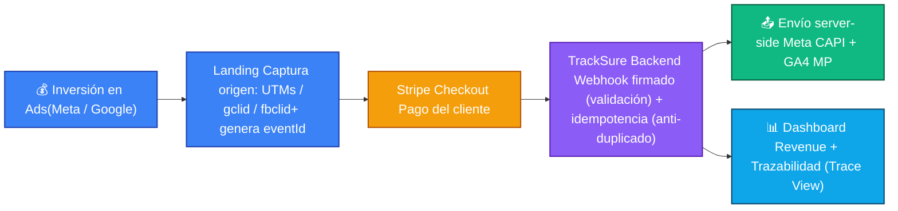

| Color | Interpretación Visual|
|---|---|
|🔵 Azul|Adquisición (dinero invertido + captura de origen)|
|🟠 Amarillo|Pago real|
|🟣 Morado|Backend (seguridad + idempotencia)|
|🟢 Verde|Integraciones server-side|
|🔷 Celeste|Observabilidad y revenue|

